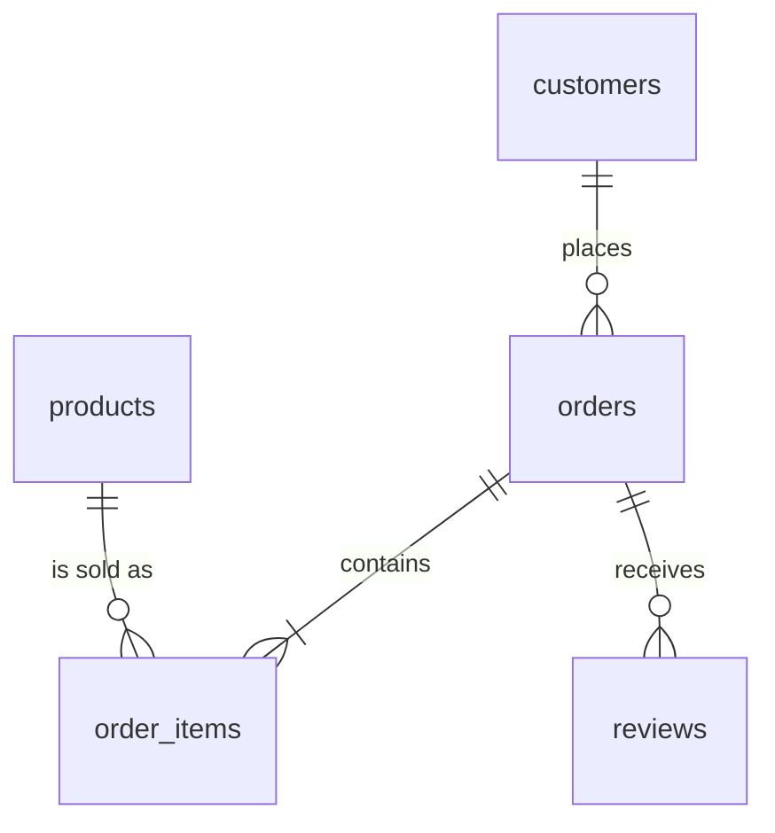

# Data Model

## Layers
| Schema | Question | Purpose | Built from |
|---|---|---|---|
| `raw` | What did we receive? | Source copy. All TEXT. No changes. | `data/raw/*.csv` |
| `clean` | What trusted entities do we have? | Typed tables with keys | `data/processed/*.csv` |
| `staging` | What work is needed between? | Step-by-step working tables | `clean` |
| `curated` | What final product do we give? | Business tables | `staging` |

Flow: `CSV -> raw` and `processed CSV -> clean -> staging -> curated`
(raw does not feed clean, clean does not hold staging tables)

## ERD

## CLEAN tables

### clean.customers
- Purpose: customer and location
- Grain: one customer record
- Primary key: `customer_id`
- Foreign key: none
- Important columns: `customer_unique_id`, `customer_city`, `customer_state`
- Types: `customer_zip_code_prefix` INTEGER, `customer_state` CHAR(2)
- Constraints: PK, `customer_state` NOT NULL

### clean.orders
- Purpose: order status and dates
- Grain: one order
- Primary key: `order_id`
- Foreign key: `customer_id` -> `clean.customers`
- Important columns: `order_status`, `order_purchase_timestamp`, `order_delivered_customer_date`, `order_estimated_delivery_date`
- Types: all dates are TIMESTAMP
- Constraints: PK, FK, `customer_id` NOT NULL

### clean.products
- Purpose: product and category
- Grain: one product
- Primary key: `product_id`
- Foreign key: none
- Important columns: `product_category_name`
- Types: sizes and weight are INTEGER
- Constraints: PK. Category can be NULL (610 products), because the source has no value

### clean.order_items
- Purpose: items sold in each order
- Grain: one order item
- Primary key: (`order_id`, `order_item_id`)
- Foreign keys: `order_id` -> `clean.orders`, `product_id` -> `clean.products`
- Important columns: `price`, `freight_value`, `shipping_limit_date`
- Types: `price` and `freight_value` NUMERIC(10,2)
- Constraints: PK, FKs, `order_item_id >= 1`, `price > 0`, `freight_value >= 0`

### clean.reviews
- Purpose: customer reviews
- Grain: one review for one order
- Primary key: (`review_id`, `order_id`)
- Foreign key: `order_id` -> `clean.orders`
- Important columns: `review_score`, review dates
- Types: `review_score` SMALLINT
- Constraints: PK, FK, `review_score` between 1 and 5

Why constraints: PK = no duplicate records. FK = no item without an order. CHECK = real-world rule (price is above 0, score is 1 to 5).

Load order: customers, products, orders, order_items, reviews (parents first).

## STAGING tables

### staging.finance_items_enriched
- One row = one order item
- Why: put item + order + product info in one place
- Change: new join to orders (INNER) and products (LEFT)
- Expected rows: 112,650 (same as order_items)
- Validate: row count, unique grain, no NULL keys, price total

### staging.finance_items_reportable
- One row = one order item that Finance can report
- Why: apply Finance rules
- Change: remove canceled/unavailable, add `reporting_month`, set category = `unknown` if empty
- Expected rows: 112,101 (549 removed)
- Validate: row count vs CLEAN, unique grain, no NULL month/category

### staging.ops_orders_base
- One row = one order
- Why: collect evidence to judge delivery
- Change: join orders to customers (state, city)
- Expected rows: 99,441 (one customer per order, so no growth)
- Validate: row count, unique `order_id`, no NULL state

### staging.ops_orders_classified
- One row = one order with a delivery class
- Why: put the late rule in one place
- Change: add `reporting_month`, `days_vs_estimate`, `delivery_classification`
- Expected rows: 99,441
- Validate: every order has 1 class, late has days > 0, same day = on_time, canceled never late

## CURATED tables

### curated.finance_monthly_category_sales
- Grain: one category in one month
- Columns: `reporting_month`, `product_category`, `item_sales_value`, `items_sold`, `distinct_orders`
- Key: (`reporting_month`, `product_category`)
- Rows: 1,282

### curated.operations_monthly_state_delivery
- Grain: one customer state in one month
- Columns: `reporting_month`, `customer_state`, `total_orders`, `delivered_orders`, `late_orders`, `late_delivery_rate`
- Key: (`reporting_month`, `customer_state`)
- Rows: 565
